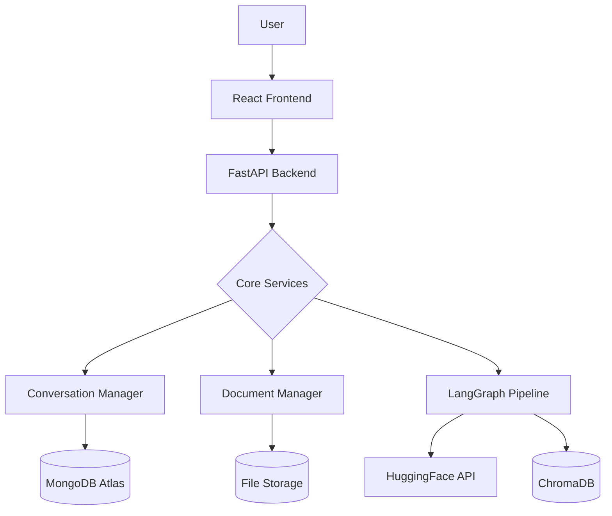

<div align="center">
  
  <h1>VeriMind AI</h1>
  <p><strong>Intent-Aligned, Evidence-Grounded AI Assistant</strong></p>
  
  [](https://www.python.org)
  [](https://fastapi.tiangolo.com)
  [](https://reactjs.org)
  [](LICENSE)
</div>

<br />

## 🌟 Overview
VeriMind AI is an enterprise-grade AI assistant designed to fundamentally solve the problem of **"AI Scope Creep"** and **Hallucination**. 

Instead of blindly expanding on a user's prompt (e.g. adding blockchain or mobile apps to a simple script request), VeriMind uses an **Intent Firewall** and a **Requirement Lock** to strictly bind the AI's generation scope. Furthermore, every claim made by the AI is logged in an **Evidence Ledger** to trace back exact sources.

---

## 🏗️ Enterprise Architecture



---

## 🧠 AI Multi-Agent Pipeline

VeriMind operates a complex LangGraph state machine with specialized agent nodes:

1. 🛡️ **Prompt Firewall**: Blocks prompt injections, jailbreaks, and malicious commands.
2. 🎯 **Intent Firewall**: Determines the core goal, extracting requested vs. not-requested features.
3. 📝 **Task Planner**: Breaks the core goal into actionable execution steps.
4. 🔒 **Requirement Lock**: Establishes a contract with `allowed_topics`, `forbidden_topics`, and strict assumption policies.
5. 📚 **Knowledge Boundary**: Determines what context/RAG data is permitted to answer this query.
6. 🚦 **Model Router**: Intelligently routes queries based on complexity.
7. ✍️ **Generation Agent**: Writes the response adhering strictly to the Requirement Lock and boundaries.
8. ⚖️ **Critic Agent**: Validates hallucinations, generates a confidence score, and maps claims to the **Evidence Ledger**.

---

## 💻 Technology Stack

| Layer | Technology |
|-------|-----------|
| **Frontend UI** | React + TypeScript, Vite, Tailwind CSS, Framer Motion |
| **Backend API** | FastAPI, LangGraph, LangChain, Python |
| **AI Models** | Hugging Face (Qwen 2.5 7B/72B) |
| **Databases** | MongoDB Atlas (Persistence), ChromaDB (Vector Search) |
| **Embeddings** | BGE-Large (Sentence Transformers) |

---

## 🚀 Getting Started

### Prerequisites
- Node.js 18+
- Python 3.11+
- Hugging Face API Token (Free Tier Supported)
- MongoDB Atlas Cluster URI

### ⚙️ Backend Setup

```bash
cd backend
python -m venv venv
# On Windows:
venv\Scripts\activate
# On Unix/Mac:
source venv/bin/activate

pip install -r requirements.txt
```

Create a `.env` file in the `backend/` directory:
```env
MONGODB_URL=mongodb+srv://<user>:<password>@cluster.mongodb.net/?retryWrites=true&w=majority
MONGODB_NAME=VeriMindDB
HUGGINGFACE_API_KEY=hf_your_key_here
```

Start the backend:
```bash
uvicorn app.main:app --reload
```

### 🎨 Frontend Setup

```bash
cd frontend
npm install
npm run dev
```

Visit `http://localhost:5173` in your browser.

---
*Built with ❤️ for precision AI interactions.*
